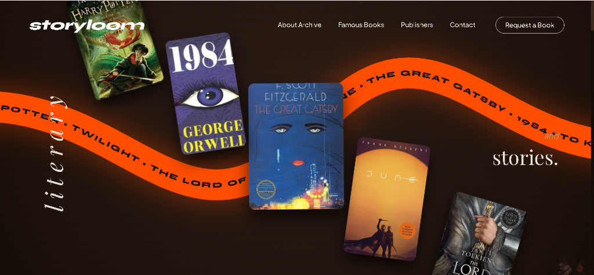
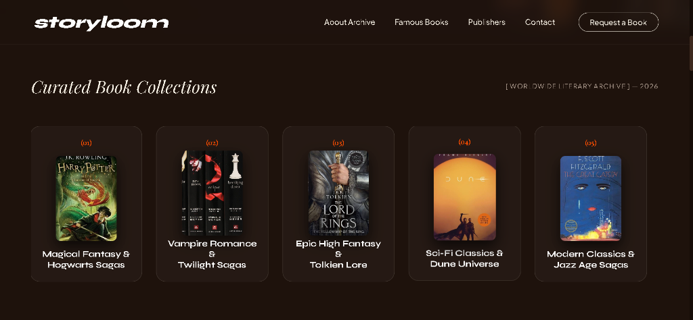
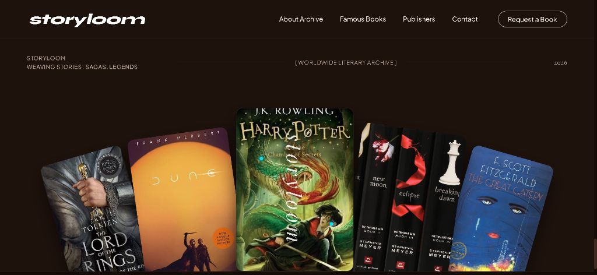
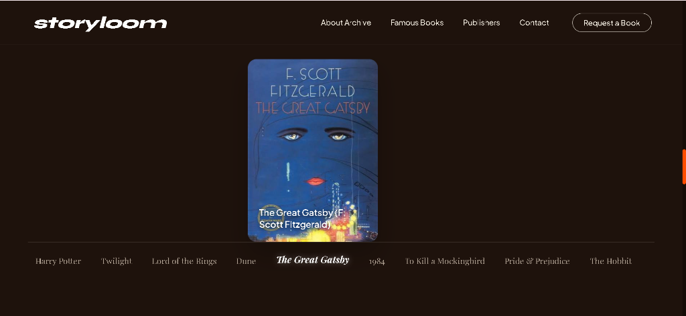
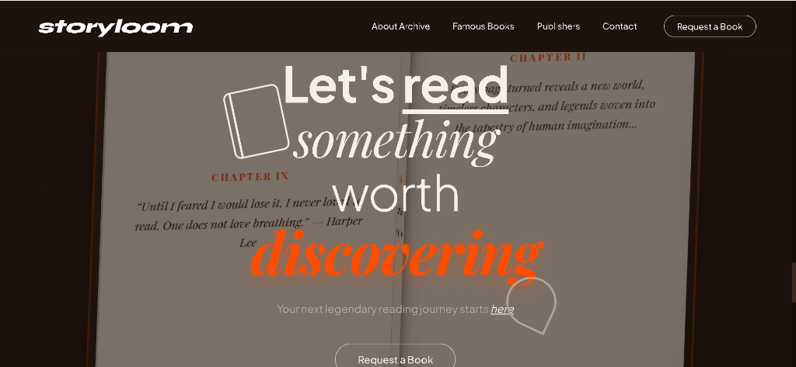

# Storyloom 📚✨

> *A World Literary Archive & Interactive Digital Showcase Celebrating Famous Books and Epic Sagas.*



---

## 🌟 Overview

**Storyloom** is an immersive, modern digital archive created to celebrate timeless literary masterpieces, legendary sagas, and world-famous book series. Built with a sleek dark aesthetic (`#1E120C`), glassmorphism, dynamic 3D CSS transformations, and 60FPS JavaScript physics, Storyloom provides an interactive journey through iconic stories across generations.

---

## ✨ Features

- **🎨 Modern Dark Aesthetic (`#1E120C`)**: Tailored obsidian dark brown palette with warm cream typography (`#F7F1E5`) and vibrant orange highlights (`#FF4D00`).
- **📚 Interactive Fanned Book Spread**: Interactive hero card spread featuring authentic covers for *Harry Potter*, *1984*, *The Great Gatsby*, *Dune*, *The Lord of the Rings*, *Twilight*, *To Kill a Mockingbird*, *Pride & Prejudice*, and *The Hobbit*.
- **⚡ Zero-Flicker Scroll Lock Pinning**: Custom continuous `requestAnimationFrame` JavaScript scroll-pinning engine that locks Section 3 smoothly while stepping through all 9 curated book collections.
- **🌌 Floating Ambient Orbs & Physics**: Interactive background particle Canvas with floating ambient lights and dynamic cursor physics.
- **📖 Grand 3D Animated Flipping Book**: A grand 3D open book experience (`rotateY` page flips, paper depth shadows, and timeless quotes from legendary authors).
- **📝 Compact "Request a Book" Modal**: Sleek, responsive modal form pop-up (`440px` max-width) enabling visitors to request special edition hardcovers and signed box sets.

---

## 📸 Additional Previews

### 🃏 Curated Book Collections


### 📚 Interactive Fanned Book Showcase


### 🔒 Interactive Accordion Scroll Pinning


### 📖 Grand 3D Page Flip CTA


---

## 📁 Project Structure

```
Website/
├── index.html            # Main HTML document structure & semantic sections
├── css/
│   └── styles.css        # Core styling system, CSS variables, 3D book & modal drawer
├── js/
│   └── app.js            # Particle physics, smooth scroll pinning & interactive handlers
├── assets/               # High-res authentic book covers & preview screenshots
│   ├── hero_preview.png
│   ├── collections_preview.png
│   ├── accordion_preview.png
│   ├── cta_3d_preview.png
│   └── [Book Covers]
├── .gitignore            # Git ignore rules
└── README.md             # Project documentation
```

---

## 🚀 Getting Started

### Prerequisites
No complex node dependencies required! Storyloom runs directly in any modern browser.

### Running Locally

1. **Clone the repository**:
   ```bash
   git clone https://github.com/Aman130901/Storyloom.git
   ```

2. **Navigate into the directory**:
   ```bash
   cd Storyloom
   ```

3. **Launch local dev server**:
   Using Python:
   ```bash
   python -m http.server 8080
   ```
   Or simply double-click `index.html` to open it in your browser!

4. **Visit in browser**:
   ```
   http://localhost:8080
   ```

---

## 🛠️ Built With

- **HTML5**: Semantic tags, accessibility standard
- **CSS3**: Vanilla CSS, Flexbox, Grid, Custom Properties, 3D CSS Transforms (`rotateY`, `perspective`)
- **JavaScript (ES6+)**: Canvas API 2D physics, `requestAnimationFrame` scroll-pinning engine
- **Lenis**: Smooth inertia scroll integration

---

## 📜 License

This project is licensed under the **MIT License**. Free to use for personal and commercial projects.
